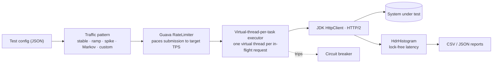

# TPS Generator

[](https://github.com/monahand1023/TPSGenerator/actions/workflows/test.yml) [](https://github.com/monahand1023/TPSGenerator/releases) [](https://openjdk.org/projects/jdk/21/) [](LICENSE)

When I was working at Amazon, we had a tool called "TPS Generator" that we would use to simulate traffic and generate traffic loads. I know that you can do a very quick solution using a tool like Postman (https://blog.postman.com/postman-api-performance-testing/), but if you need something a bit more customizable and flexible, you may need to build out your own solution.
My solution here is a robust, flexible, and feature-rich load testing tool for generating controlled HTTP traffic patterns to test API performance and reliability. If you also need to use a quick scaffolding to mock a service, be sure to check out my TPSGenerator-Server to quickly do this: https://github.com/monahand1023/TPSGenerator-Server

## How it works



In-flight virtual threads settle at roughly `TPS × latency` (Little's Law) — concurrency is bounded by real load, not a fixed worker pool.

## Table of Contents


- [Project Overview](#project-overview)
- [Features](#features)
- [Architecture](#architecture)
- [Getting Started](#getting-started)
    - [Prerequisites](#prerequisites)
    - [Building the Project](#building-the-project)
    - [Docker](#docker)
    - [Configuration](#configuration)
- [Usage](#usage)
    - [Basic Usage](#basic-usage)
    - [Traffic Patterns](#traffic-patterns)
    - [Request Templates](#request-templates)
    - [Parameter Sources](#parameter-sources)
- [Metrics and Reports](#metrics-and-reports)
- [Advanced Features](#advanced-features)
    - [Circuit Breaker](#circuit-breaker)
    - [Dashboard Integration](#dashboard-integration)
    - [Resource Monitoring](#resource-monitoring)
- [Testing](#testing)
- [Performance Optimizations](#performance-optimizations)
- [Benchmark / Sample Run](#benchmark--sample-run)
- [License](#license)

## Project Overview

TPS Generator is a Java-based load testing tool designed to generate controlled HTTP traffic with configurable patterns. It allows you to test the performance, reliability, and scalability of your APIs and web services by simulating realistic traffic conditions. The tool provides comprehensive metrics collection, resource monitoring, and detailed reporting capabilities.

## Features

- **Virtual-Thread Concurrency (Java 21 / Project Loom)**: Each in-flight request runs on its own lightweight virtual thread; in-flight count settles at roughly `TPS × latency` (Little's Law) rather than being capped by a fixed worker pool. An optional `submissionThreads` shards the pacing loop for very high target TPS.
- **Flexible Traffic Patterns**: stable, ramp-up, spike, or custom (CSV) patterns
- **Coordinated-Omission-Correct Latency**: single HdrHistogram pipeline with `recordValueWithExpectedInterval`, so a slow target can't hide behind an under-issuing generator
- **Parameterized Requests**: values from files or random generators (uniform / normal / selection)
- **Chained / Correlated Scenarios**: multi-step sessions that extract values from one response (regex/header) and use them in the next, with think-time
- **WebSocket Load Driver**: `protocol: websocket` for WS round-trip load (gRPC not supported)
- **Response Validation**: optional status/body/size assertions that count as failures
- **SLA Assertions**: pass/fail latency/throughput/success-rate budgets that set the exit code (CI gate)
- **Run Comparison**: `compare` two result files and fail on regression
- **Distributed Aggregation**: each run exports its encoded histogram; `merge` combines N node runs with correct percentile math
- **Per-Request Timeouts**: real `HttpRequest.timeout()` that cancels the exchange (no leaked connections)
- **Circuit Breaker Protection**: O(1) sliding-window breaker that stops a run on excessive errors
- **Comprehensive Metrics**: response times, success/TPS (offered vs achieved), status codes, network, CPU/memory/threads
- **Real-time Monitoring**: `--live` in-place status line; optional live dashboard streaming (works with TPSGenerator-Server)
- **Detailed Reports**: CSV + JSON export (JSON includes the encoded latency histogram)

## Architecture

The TPS Generator is built with a modular architecture focusing on separation of concerns:

### Core Components

- **ExecutionController**: Orchestrates the test execution, manages threads, and controls traffic rates
- **RequestExecutor**: Executes HTTP requests and collects performance metrics (uses Builder pattern for configuration)
- **CircuitBreaker**: Monitors success/failure rates and prevents excessive failures (with cached error rates for O(1) lookups)

### Factory Classes

- **TrafficPatternFactory**: Creates traffic pattern instances from configuration (stable, rampup, spike, custom)
- **ParameterSourceFactory**: Creates parameter sources from configuration (random, file-based)

### Traffic Patterns

The tool supports various traffic pattern implementations:

- **StablePattern**: Maintains a constant TPS throughout the test
- **RampUpPattern**: Linearly increases TPS from a start value to a target value
- **SpikePattern**: Maintains a base TPS with spikes of higher TPS at specified times
- **CustomPattern**: Allows defining custom TPS values over time

### Request Management

- **RequestGenerator**: Generates HTTP requests based on templates and parameter sources
- **RequestTemplate**: Defines the structure of requests with parameter placeholders
- **Parameter Sources**: Provide values for parameters (file-based, random)
- **ResponseValidator**: Optional response validation with body and status code checks

### Metrics and Monitoring

- **MetricsCollector**: Collects and aggregates test metrics with periodic snapshot updates
  - **RequestTracker**: Tracks active HTTP requests with timing information
  - **TpsCalculator**: Calculates real-time TPS using lock-free counters
- **TestMetrics**: Aggregates all test metrics using composition pattern
  - **ResponseTimeMetrics**: Tracks response times using HdrHistogram's lock-free Recorder pattern
  - **StatusCodeMetrics**: Thread-safe status code tracking with ConcurrentHashMap
  - **TpsMetrics**: Bounded TPS sample collection
- **NetworkMetrics**: Tracks network-level metrics (bytes sent/received, response sizes)
- **ResourceMonitor**: Monitors system resources (CPU, memory, threads) with bounded snapshot storage
- **ErrorAnalyzer**: Analyzes errors and failures with optimized single-pass stream operations

### Reporting

- **CSVExporter**: Exports metrics to CSV files for analysis
- **DashboardClient**: Sends metrics to a dashboard service for visualization

## Getting Started

### Prerequisites

- Java 21 or higher (the request engine uses virtual threads / Project Loom)
- Maven 3.6 or higher

### Building the Project

Clone the repository and build the project using Maven:


```bash
git clone https://github.com/monahand1023/tps-generator.git
cd tps-generator
mvn clean package
```

This will create a runnable JAR file in the `target` directory.

### Docker

A public image is available from GitHub Container Registry — no login required to pull:

```bash
docker pull ghcr.io/monahand1023/tpsgenerator:latest
```

The entrypoint is the generator, so arguments are `<config.json> <output-dir>` (or a
`compare` / `merge` subcommand). Mount your config in and point at it:

```bash
docker run --rm -v "$PWD:/work" \
  ghcr.io/monahand1023/tpsgenerator:latest /work/config.json /work/results
```

The container's working directory is `/work`, so a bind-mounted directory there receives the
CSV/JSON results (and the run summary prints to stdout). The image is multi-stage (build with
Maven + JDK 21, run on a JRE 21 base) and runs as a non-root user. Build it locally with:

```bash
docker build -t tps-generator .
```

To drive load against the [mock server](https://github.com/monahand1023/TPSGenerator-Server)
with a single command, see the `docker compose --profile demo` setup in that repo. Images are
published automatically by `.github/workflows/docker-publish.yml` on every push to `main` and
on `v*` tags. The package is **public**, so anyone can `docker pull` it without authenticating;
both `linux/amd64` and `linux/arm64` are built.

### Configuration

TPS Generator uses JSON configuration files to define test parameters.

> **Durations** accept both human-friendly (`"2m"`, `"45s"`, `"1h30m"`) and ISO-8601 (`"PT2M"`, `"PT45S"`) forms.
>
> The `threadPool` block is **retained for backward compatibility but no longer bounds concurrency** — since the engine runs one virtual thread per request, offered load is controlled by the traffic pattern / target TPS rather than a worker-pool size.

Here's a sample configuration:

```json
{
  "name": "Mock API Load Test",
  "targetServiceUrl": "http://localhost:8080",
  "testDuration": "PT2M",

  "trafficPattern": {
    "type": "spike",
    "targetTps": 30,
    "spikeTps": 100,
    "spikeStartTime": "PT45S",
    "spikeDuration": "PT15S"
  },

  "threadPool": {
    "coreSize": 20,
    "maxSize": 50,
    "queueSize": 100,
    "keepAliveTime": "PT60S"
  },

  "requestTemplates": [
    {
      "name": "getResource",
      "weight": 70,
      "method": "GET",
      "urlTemplate": "http://localhost:8080/api/resources",
      "headers": {
        "Authorization": "Bearer token123",
        "Accept": "application/json"
      }
    },
    {
      "name": "createResource",
      "weight": 30,
      "method": "POST",
      "urlTemplate": "http://localhost:8080/api/orders",
      "headers": {
        "Content-Type": "application/json",
        "Authorization": "Bearer token123"
      },
      "bodyTemplate": "{\"productId\":\"${productId}\",\"quantity\":${quantity}}"
    }
  ],

  "parameterSources": {
    "resourceId": {
      "type": "random",
      "range": [1, 1000]
    },
    "productId": {
      "type": "random",
      "range": [100, 999]
    },
    "quantity": {
      "type": "random",
      "distribution": "normal",
      "mean": 3,
      "stddev": 1,
      "min": 1,
      "max": 10
    }
  },

  "metrics": {
    "responseTimePercentiles": [50, 90, 95, 99],
    "outputFile": "results.csv",
    "resourceMonitoring": {
      "enabled": true,
      "sampleInterval": "PT5S"
    }
  },

  "circuitBreaker": {
    "enabled": true,
    "errorThreshold": 0.3,
    "windowSize": 50
  }
}
```

## Usage

### Basic Usage

Run a test using the following command:

```bash
java -jar target/tps-generator-1.0.0.jar path/to/test-config.json [output-directory]
```

Where:
- `test-config.json` is your test configuration file
- `output-directory` (optional) is where results will be stored (default: `results`)

For verbose logging, add the `--verbose` flag:

```bash
java -jar target/tps-generator-1.0.0.jar path/to/test-config.json results --verbose
```

For a live, in-place status line during the run (TPS, success rate, p50/p95/p99, request count,
progress), add `--live`:

```bash
java -jar target/tps-generator-1.0.0.jar path/to/test-config.json results --live
```

### Traffic Patterns

The tool supports several traffic patterns:

#### Stable Pattern

Maintains a constant TPS rate throughout the test:

```json
"trafficPattern": {
  "type": "stable",
  "targetTps": 100
}
```

#### Ramp-up Pattern

Linearly increases TPS from a start value to a target value:

```json
"trafficPattern": {
  "type": "rampUp",
  "startTps": 10,
  "targetTps": 100,
  "rampDuration": "PT2M"
}
```

#### Spike Pattern

Maintains a base TPS with spikes of higher TPS at specific times:

```json
"trafficPattern": {
  "type": "spike",
  "targetTps": 50,
  "spikeTps": 200,
  "spikeStartTime": "PT5M",
  "spikeDuration": "PT30S"
}
```

#### Custom Pattern

Loads TPS values from a CSV file:

```json
"trafficPattern": {
  "type": "custom",
  "patternFile": "patterns/custom-pattern.csv"
}
```

### Request Templates

Request templates define the structure of HTTP requests with parameter placeholders:

```json
"requestTemplates": [
  {
    "name": "getResource",
    "weight": 70,
    "method": "GET",
    "urlTemplate": "${targetServiceUrl}/api/resources/${resourceId}",
    "headers": {
      "Authorization": "Bearer ${authToken}",
      "Accept": "application/json"
    }
  }
]
```

- `name`: A descriptive name for the template
- `weight`: The relative frequency of this template when selecting randomly
- `method`: The HTTP method (GET, POST, PUT, DELETE)
- `urlTemplate`: The URL with optional parameter placeholders
- `headers`: HTTP headers with optional parameter placeholders
- `bodyTemplate`: Request body template with parameter placeholders (for POST/PUT)

### Parameter Sources

Parameter sources provide values for request templates:

#### Random Parameters

Generate random integer values:

```json
"userId": {
  "type": "random",
  "range": [1000, 9999]
}
```

Generate values with normal distribution:

```json
"quantity": {
  "type": "random",
  "distribution": "normal",
  "mean": 3,
  "stddev": 1,
  "min": 1,
  "max": 10
}
```

Select from a predefined set:

```json
"status": {
  "type": "random",
  "range": ["pending", "active", "completed", "cancelled"]
}
```

#### File Parameters

Read values from a text file:

```json
"authToken": {
  "type": "file",
  "path": "tokens.txt",
  "selection": "round-robin"
}
```

Read values from a CSV file column:

```json
"username": {
  "type": "file",
  "path": "users.csv",
  "column": "username",
  "selection": "random"
}
```

## Scenarios (Chained / Correlated Requests)

For multi-step user journeys, define a `scenario` instead of (or alongside) `requestTemplates`. Each
rate-limited slot starts a **session** that runs the steps in order on one virtual thread, threading a
context through them. A step can **extract** values from its response (regex capture group, or a
header) into the context; later steps reference them as `${vars}`. In scenario mode the target TPS is
the **session start rate**, and a failed step aborts that session.

```json
{
  "name": "login-then-fetch",
  "targetServiceUrl": "http://localhost:8080",
  "testDuration": "1m",
  "trafficPattern": { "type": "stable", "targetTps": 20 },
  "scenario": [
    {
      "name": "login",
      "request": {
        "method": "POST",
        "urlTemplate": "http://localhost:8080/api/auth/login",
        "bodyTemplate": "{\"user\":\"u${userId}\"}"
      },
      "extract": [
        { "name": "token", "from": "body", "expr": "\"token\":\"([^\"]+)\"" }
      ]
    },
    {
      "name": "fetch",
      "request": {
        "method": "GET",
        "urlTemplate": "http://localhost:8080/api/data",
        "headers": { "Authorization": "Bearer ${token}" }
      },
      "thinkTimeMs": 250
    }
  ],
  "parameterSources": { "userId": { "type": "random", "range": [1, 1000] } }
}
```

- `extract[].from`: `body` (the `expr` is a regex and capture group 1 is taken) or `header` (the `expr` is the header name).
- Steps may use any context value: default params (`${requestId}`, `${timestamp}`), parameter-source values, and anything extracted by earlier steps.
- `thinkTimeMs` pauses after a step, simulating user think time.

## WebSocket Load Testing

Set `protocol` to `websocket` to drive a WebSocket endpoint instead of HTTP. Each rate-limited slot
opens a WebSocket to `targetServiceUrl` (the `http(s)` scheme is converted to `ws(s)`), sends
`webSocketMessage`, waits for one reply, and closes — recording the round-trip as success/failure
plus latency.

```json
{
  "name": "ws-echo-load",
  "targetServiceUrl": "http://localhost:8080/ws",
  "testDuration": "1m",
  "protocol": "websocket",
  "webSocketMessage": "ping",
  "trafficPattern": { "type": "stable", "targetTps": 100 }
}
```

> This is a connect-send-receive-close exchange per slot (so it also exercises connection setup);
> persistent multi-message sessions are not modeled. (gRPC is not yet supported.)

## Metrics and Reports

TPS Generator collects comprehensive metrics during test execution:

- **Request Counts**: Total, successful, failed, timed out, and skipped requests
- **Response Times**: Min, max, average, and percentiles (P50, P90, P95, P99)
- **TPS Rates**: Current, average, and maximum TPS
- **Status Codes**: Distribution of HTTP status codes
- **Resource Usage**: CPU, memory, thread counts
- **Network Metrics**: Bytes sent and received, request and response sizes

Test results are automatically exported to CSV files:
- `results.csv`: Main test metrics
- `tps_samples.csv`: TPS measurements over time
- `resource_snapshots.csv`: CPU and memory usage over time

Example output:

```
=== Test Summary ===
Duration: 00:05:00
Total Requests: 25000
Successful Requests: 24850
Failed Requests: 150
Success Rate: 99.40%
Average TPS: 83.33
P95 Response Time: 245 ms
Max CPU Usage: 78.20%
Max Memory Usage: 512.45 MB
==================
```

## Advanced Features

### Circuit Breaker

The circuit breaker monitors success/failure rates and prevents excessive failures:

```json
"circuitBreaker": {
  "enabled": true,
  "errorThreshold": 0.5,
  "windowSize": 100
}
```

- `enabled`: Whether the circuit breaker is active
- `errorThreshold`: Error rate threshold (0.0-1.0) that will trigger the circuit breaker
- `windowSize`: Number of recent requests to consider for error rate calculation

When the error rate exceeds the threshold, the circuit breaker "opens" and stops sending requests.

### Dashboard Integration

TPS Generator streams live metrics (register → periodic updates → final result) to a dashboard
service. **TPSGenerator-Server implements this backend** and serves a live UI at `/dashboard`, so
enabling the block below points the run at it out of the box:

```json
"dashboard": {
  "enabled": true,
  "url": "http://localhost:8080",
  "apiKey": "your-api-key"
}
```

`url` is the dashboard server base URL; `apiKey` is optional and sent as `X-API-Key` only when set
(it must match the server's `DASHBOARD_API_KEY` if the server has one configured). Open
`http://localhost:8080/dashboard` in a browser to watch runs update in real time. Dashboard
reporting is best-effort — if the dashboard is unreachable the load test still runs and reports
normally.

### Resource Monitoring

Enable resource monitoring to track CPU, memory, and thread usage:

```json
"resourceMonitoring": {
"enabled": true,
"sampleInterval": "PT5S"
}
```

## Sample Console Output

Below is the output for the above sample configuration file.

```
025-04-22 11:49:48 [main] INFO  i.k.t.TPSGeneratorApplication - Verbose logging enabled
2025-04-22 11:49:48 [main] INFO  i.k.t.TPSGeneratorApplication - Loaded test configuration: Mock API Load Test
2025-04-22 11:49:48 [main] INFO  i.k.t.metrics.ResourceMonitor - Initialized resource monitor
2025-04-22 11:49:48 [main] INFO  i.k.t.metrics.MetricsCollector - Initialized metrics collector
2025-04-22 11:49:48 [main] INFO  i.k.t.request.RequestGenerator - Initialized parameter source for 'resourceId'
2025-04-22 11:49:48 [main] INFO  i.k.t.request.RequestGenerator - Initialized parameter source for 'productId'
2025-04-22 11:49:48 [main] INFO  i.k.t.request.RequestGenerator - Initialized parameter source for 'quantity'
2025-04-22 11:49:48 [main] INFO  i.k.t.request.RequestGenerator - Initialized request generator with 2 templates and 3 parameter sources
2025-04-22 11:49:48 [main] INFO  i.k.tpsgenerator.core.CircuitBreaker - Initialized circuit breaker with error threshold 0.3, window size 50
2025-04-22 11:49:48 [main] INFO  i.k.t.core.ExecutionController - Initialized execution controller with traffic pattern: SpikePattern(baseTps=30.00, spikeTps=100.00, spikeStart=45000 ms, spikeDuration=15000 ms)
2025-04-22 11:49:48 [main] INFO  i.k.t.TPSGeneratorApplication - Starting test execution...
2025-04-22 11:49:48 [main] INFO  i.k.t.metrics.ResourceMonitor - Started resource monitoring with sample interval PT5S
2025-04-22 11:49:48 [main] INFO  i.k.t.metrics.MetricsCollector - Started metrics collection at 1745347788303
2025-04-22 11:49:48 [pool-2-thread-1] INFO  i.k.t.core.ExecutionController - Progress: 0.0% | Target TPS: 30.00 | Actual TPS: 0.00 | Success Rate: 0.00%
2025-04-22 11:49:48 [main] INFO  i.k.t.core.ExecutionController - Test started, will run for 120 seconds
2025-04-22 11:49:58 [pool-2-thread-1] INFO  i.k.t.core.ExecutionController - Progress: 8.3% | Target TPS: 30.00 | Actual TPS: 29.00 | Success Rate: 99.34%
2025-04-22 11:50:08 [pool-2-thread-1] INFO  i.k.t.core.ExecutionController - Progress: 16.7% | Target TPS: 30.00 | Actual TPS: 30.00 | Success Rate: 99.67%
2025-04-22 11:50:18 [pool-2-thread-1] INFO  i.k.t.core.ExecutionController - Progress: 25.0% | Target TPS: 30.00 | Actual TPS: 29.00 | Success Rate: 99.67%
2025-04-22 11:50:28 [pool-2-thread-1] INFO  i.k.t.core.ExecutionController - Progress: 33.3% | Target TPS: 30.00 | Actual TPS: 29.00 | Success Rate: 99.83%
2025-04-22 11:50:38 [pool-2-thread-1] INFO  i.k.t.core.ExecutionController - Progress: 41.7% | Target TPS: 100.00 | Actual TPS: 100.00 | Success Rate: 99.71%
2025-04-22 11:50:48 [pool-2-thread-1] INFO  i.k.t.core.ExecutionController - Progress: 50.0% | Target TPS: 30.00 | Actual TPS: 100.00 | Success Rate: 99.71%
2025-04-22 11:50:58 [pool-2-thread-1] INFO  i.k.t.core.ExecutionController - Progress: 58.3% | Target TPS: 30.00 | Actual TPS: 30.00 | Success Rate: 99.93%
2025-04-22 11:51:08 [pool-2-thread-1] INFO  i.k.t.core.ExecutionController - Progress: 66.7% | Target TPS: 30.00 | Actual TPS: 30.00 | Success Rate: 99.94%
2025-04-22 11:51:18 [pool-2-thread-1] INFO  i.k.t.core.ExecutionController - Progress: 75.0% | Target TPS: 30.00 | Actual TPS: 30.00 | Success Rate: 99.95%
2025-04-22 11:51:28 [pool-2-thread-1] INFO  i.k.t.core.ExecutionController - Progress: 83.3% | Target TPS: 30.00 | Actual TPS: 30.00 | Success Rate: 99.97%
2025-04-22 11:51:38 [pool-2-thread-1] INFO  i.k.t.core.ExecutionController - Progress: 91.7% | Target TPS: 30.00 | Actual TPS: 29.00 | Success Rate: 99.95%
2025-04-22 11:51:48 [pool-2-thread-1] INFO  i.k.t.core.ExecutionController - Progress: 100.0% | Target TPS: 30.00 | Actual TPS: 30.00 | Success Rate: 99.98%
2025-04-22 11:51:48 [main] INFO  i.k.t.core.ExecutionController - Test execution completed, waiting for pending requests to finish
2025-04-22 11:51:52 [main] INFO  i.k.t.metrics.MetricsCollector - Stopped metrics collection, test duration: 123938 ms
2025-04-22 11:51:52 [main] INFO  i.k.t.TPSGeneratorApplication - Test completed in 00:02:03
2025-04-22 11:51:52 [main] INFO  i.k.t.metrics.exporter.CSVExporter - Exporting metrics to /Users/danm/IdeaProjects/TPSGenerator/results/Mock API Load Test_20250422_114948.csv
2025-04-22 11:51:52 [main] INFO  i.k.t.metrics.exporter.CSVExporter - Metrics exported successfully
2025-04-22 11:51:52 [main] INFO  i.k.t.TPSGeneratorApplication - Results exported to results/Mock API Load Test_20250422_114948.csv

=== Test Summary ===
Duration: 00:02:03
Total Requests: 4685
Successful Requests: 4685
Failed Requests: 0
Success Rate: 100.00%
Average TPS: 37.80
P95 Response Time: 101 ms
Max CPU Usage: 20.61%
Max Memory Usage: 96.34 MB
==================

Process finished with exit code 0
```

## Configuration Validation

At startup, `TestConfig.validate()` is called immediately after loading the configuration file. If the configuration is invalid the tool prints a clear error message and exits with code 1 before starting any test traffic.

The following conditions are caught:

| Check | Error message |
|---|---|
| `name` is null or blank | `Test name cannot be null or empty` |
| `testDuration` is null, zero, or negative | `Test duration must be a positive duration` |
| `trafficPattern` is null | `Traffic pattern configuration is required` |
| `trafficPattern.type` is null/blank | `Traffic pattern type is required` |
| `targetTps <= 0` for any non-`custom` pattern | `Target TPS must be positive for pattern type: <type>` |
| `threadPool.coreSize <= 0` (only if a `threadPool` block is present) | `Thread pool core size must be positive` |
| `threadPool.maxSize < coreSize` (only if a `threadPool` block is present) | `Thread pool max size must be >= core size` |
| No request templates | `At least one request template is required` |

> **Note:** The `custom` traffic pattern does not require `targetTps` to be set — its TPS values come from the `patternFile`.

## Dashboard Integration Backend API

The `DashboardClient` expects the backend server (e.g. TPSGenerator-Server) to expose these endpoints:

| Method | Path | Description |
|--------|------|-------------|
| `POST` | `/api/tests/register` | Register a new test run. Body: `{testId, testName, targetServiceUrl, startTime, testDuration}` |
| `POST` | `/api/metrics/update` | Send periodic metrics update. Body: `{testId, timestamp, summary, statusCodes, resources}` |
| `POST` | `/api/tests/finish` | Mark test as finished. Body: `{testId, endTime}` |
| `POST` | `/api/tests/result` | Send final test result. Body: full metrics payload |

All requests include an `X-API-Key` header if `metrics.dashboard.apiKey` is set in the config.

## Testing

The project includes comprehensive unit tests covering core functionality:

```bash
# Run all tests
mvn test

# Run specific test class
mvn test -Dtest=CircuitBreakerTest
```

Test coverage includes:
- **CircuitBreakerTest**: Circuit breaker state transitions and error rate calculations
- **ResponseTimeMetricsTest**: Histogram recording, percentile calculations, thread safety
- **StatusCodeMetricsTest**: Status code counting and retrieval
- **TpsMetricsTest**: TPS sample recording with bounded storage
- **TrafficPatternFactoryTest**: Factory pattern creation for all traffic types
- **ParameterSourceFactoryTest**: Parameter source creation and validation
- **CustomPatternTest**: CSV pattern loading and interpolation
- **TestConfigTest**: Configuration validation

## Performance Optimizations

The codebase includes several performance optimizations:

- **Lock-free histogram recording**: Uses HdrHistogram's Recorder pattern for concurrent response time recording without synchronization overhead
- **Cached error rates**: CircuitBreaker caches error rates for O(1) lookups instead of recalculating on each request
- **Binary search for custom patterns**: CustomPattern uses binary search (O(log n)) instead of linear search for TPS lookups
- **Bounded collections**: ResourceMonitor and TpsMetrics use bounded collections to prevent memory growth during long tests
- **Single-pass stream operations**: ErrorAnalyzer consolidates multiple stream passes into single iterations
- **Thread-safe bounded deques**: ErrorAnalyzer uses LinkedBlockingDeque for memory-bounded error sample storage
- **Centralized constants**: All magic numbers are centralized in the Constants class for easy configuration
- **Proper resource cleanup**: ExecutionController implements Closeable with shutdown hooks for graceful cleanup

## Distributed Load Generation

To generate more load than one machine can, run the tool on N nodes and **merge** their results.
Each node runs the same config at `targetTps / N`; afterwards combine the JSON result files:

```bash
# on each node (e.g. 4 nodes, each at 1/4 of the total target TPS):
java -jar tps-generator.jar config.json results-nodeA
# ... nodeB, nodeC, nodeD ...

# then merge the per-node JSON results into one combined report:
java -jar tps-generator.jar merge combined.json \
    results-nodeA/*.json results-nodeB/*.json results-nodeC/*.json results-nodeD/*.json
```

Merging is mathematically correct: counts and offered TPS are summed, and latency percentiles are
recomputed from the **merged HdrHistogram** (each run exports its encoded histogram in the JSON), not
by averaging percentiles. The merged document has the same shape and can itself be merged further.

## Benchmark / Sample Run

A loopback run used to validate the full pipeline (generator → mock server → metrics). The
[mock HTTP server](../TPSGenerator-Server) and the generator ran on the **same machine**, so these
numbers measure the tooling end-to-end, not a production target. Treat them as a smoke test of
sustained throughput and latency accuracy, not a published throughput ceiling.

**Environment**

| | |
|---|---|
| Machine | Apple Silicon (Mac16,11), 14 cores, 64 GB RAM |
| OS / JDK | macOS 26.5, OpenJDK 21.0.11 (virtual threads enabled on the server) |
| Topology | Generator and mock server on `localhost` (loopback) |

**Config** (`bench.json`): 2,000 TPS stable, 20 s test + 2 s warmup, two weighted templates:

- 70% `GET /users` — mock latency 5–25 ms (lognormal), 0% error rate
- 30% `POST /orders` — mock latency 10–60 ms (lognormal), 1% error rate

```bash
java -jar tps-generator.jar bench.json results/
```

**Results**

| Metric | Value |
|---|---|
| Total requests | 40,007 |
| Success rate | 99.72% (111 failures) |
| Offered TPS | 1,998 (peak achieved 2,015) |
| Latency p50 | 12 ms |
| Latency p95 | 31 ms |
| Latency p99 | 41 ms |
| Latency max | 61 ms |
| Latency mean | 14.7 ms |
| Load-generator footprint | peak 21.3% CPU, ~643 MB resident (heap ~604 MB) |

The generator held the offered rate (1,998 of 2,000 TPS) for the full window, and the observed
latency tracks the configured server-side delay distributions: the p99 of 41 ms sits inside the
10–60 ms `lognormal` band of the slower `/orders` endpoint, and the 0.28% measured error rate
matches the 1% error rate applied to the 30% of traffic hitting `/orders`. Latencies are HDR
percentiles with coordinated-omission correction, so they reflect what a closed-loop client would
have seen rather than only the requests that completed quickly.

## License

This project is licensed under the MIT License - see the LICENSE file for details.
